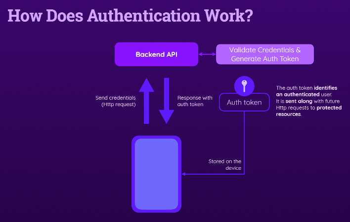

# S11 User Authentication

Trong phần này của khóa học, chúng ta sẽ tập trung vào tính năng quan trọng là Xác Thực Người Dùng cho các ứng dụng React Native, điều mà có thể cần cho nhiều ứng dụng. Bạn sẽ học cách thêm chức năng đăng ký và đăng nhập cho ứng dụng React Native, sử dụng một dự án mẫu để bắt đầu.

1. **Thêm Xác Thực Người Dùng:**

    - Cung cấp các chức năng đăng ký và đăng nhập.
    - Quản lý trạng thái xác thực của người dùng trong ứng dụng.

2. **Quản Lý Trạng Thái Xác Thực:**

    - Kiểm tra trạng thái đăng nhập của người dùng.
    - Sử dụng trạng thái này để truy cập các tài nguyên bảo vệ từ backend hoặc API.

3. **Lưu Trữ Trạng Thái Xác Thực:**
    - Lưu trữ và truy xuất trạng thái xác thực trên thiết bị.
    - Tự động đăng nhập người dùng khi họ mở lại ứng dụng.

Chúng ta sẽ bắt đầu với một dự án mẫu được cung cấp và tiếp tục từ đó.

-   **Signing Users Up & Logging In**
-   **Managing Authentication Status**
-   **Storing Authentication Status on the Device**

## How does Authentication work?

Authentication hoạt động như sau:

1. **Ứng Dụng và Backend:**

    - Ứng dụng chạy trên thiết bị di động cần kết nối với một backend API (như Firebase hoặc API khác) để xác thực người dùng.

2. **Gửi Thông Tin Đăng Nhập:**

    - Khi người dùng nhập email và mật khẩu vào biểu mẫu, thông tin này được gửi đến backend qua yêu cầu HTTP.

3. **Xác Thực trên Backend:**

    - Backend kiểm tra email và mật khẩu, xác minh tính hợp lệ. Nếu là người dùng mới, email và mật khẩu cũng được kiểm tra.

4. **Tạo Token Xác Thực:**

    - Nếu thông tin đăng nhập hợp lệ, backend tạo một token xác thực (chuỗi văn bản được ký bởi backend) và gửi lại cho thiết bị.

5. **Lưu và Sử Dụng Token:**

    - Token được lưu trên thiết bị và dùng cho các yêu cầu HTTP tiếp theo đến backend. Token giúp xác thực các yêu cầu và truy cập vào các tài nguyên bảo vệ.

6. **Xác Thực Trong Tương Lai:**
    - Mỗi yêu cầu đến các điểm cuối API bảo vệ sẽ bao gồm token. Backend sẽ xác minh token để cấp quyền truy cập.

Chúng ta sẽ xem các khía cạnh này trong thực hành trong phần tiếp theo của khóa học.

Authentication là quá trình xác thực danh tính của người dùng khi họ cố gắng truy cập vào một ứng dụng hoặc dịch vụ. Đây là một phần quan trọng trong bảo mật ứng dụng và có thể được thực hiện thông qua nhiều phương pháp khác nhau. Dưới đây là cách authentication thường hoạt động với backend API:

### **1. Đăng Ký Người Dùng (Sign Up)**

1. **Người dùng gửi yêu cầu đăng ký:**

    - Người dùng cung cấp thông tin như tên, email, mật khẩu qua biểu mẫu đăng ký trong ứng dụng.

2. **Backend xử lý yêu cầu:**

    - Backend API nhận thông tin, xác minh và lưu trữ dữ liệu người dùng vào cơ sở dữ liệu.
    - Mật khẩu thường được mã hóa (hashing) trước khi lưu trữ để đảm bảo an toàn.

3. **Phản hồi:**
    - Nếu đăng ký thành công, backend API có thể trả về một thông báo xác nhận hoặc token xác thực (nếu cần).

### **2. Đăng Nhập Người Dùng (Login)**

1. **Người dùng gửi yêu cầu đăng nhập:**

    - Người dùng cung cấp thông tin đăng nhập (email, mật khẩu) qua biểu mẫu đăng nhập.

2. **Backend kiểm tra thông tin:**

    - Backend API so sánh thông tin đăng nhập với dữ liệu lưu trữ trong cơ sở dữ liệu.
    - Mật khẩu được mã hóa và so sánh với giá trị đã mã hóa trong cơ sở dữ liệu.

3. **Tạo và gửi token:**
    - Nếu thông tin đăng nhập hợp lệ, backend API tạo một token xác thực (JWT hoặc session token).
    - Token này được gửi lại cho ứng dụng và có thể được lưu trữ trên thiết bị của người dùng (ví dụ: trong local storage hoặc cookie).

### **3. Quản Lý Phiên (Session Management)**

1. **Xác thực yêu cầu từ người dùng:**

    - Mỗi khi người dùng gửi yêu cầu tới backend API (ví dụ: truy cập tài nguyên bảo vệ), họ cần gửi token xác thực kèm theo trong header của yêu cầu.

2. **Kiểm tra token:**

    - Backend API kiểm tra tính hợp lệ của token (có còn hiệu lực không, có bị thay đổi không).
    - Nếu token hợp lệ, yêu cầu được xử lý; nếu không, API trả về lỗi xác thực (401 Unauthorized).

3. **Quản lý trạng thái đăng nhập:**
    - Token có thể có thời gian hết hạn và cần được làm mới khi hết hạn.
    - Người dùng có thể được tự động đăng nhập lại nếu token vẫn hợp lệ và còn hiệu lực.

### **4. Đăng Xuất (Logout)**

1. **Người dùng gửi yêu cầu đăng xuất:**

    - Người dùng có thể yêu cầu đăng xuất, xóa token xác thực khỏi thiết bị.

2. **Backend xử lý yêu cầu:**

    - Token có thể bị thu hồi hoặc đánh dấu là không hợp lệ nếu sử dụng session-based authentication.

3. **Cập nhật giao diện:**
    - Ứng dụng thông báo người dùng đã đăng xuất thành công và chuyển hướng về màn hình đăng nhập.

### **Tóm Tắt**

-   **Đăng ký và Đăng nhập**: Thực hiện qua các yêu cầu HTTP, lưu trữ và mã hóa thông tin người dùng.
-   **Token Xác Thực**: Cung cấp và kiểm tra thông qua các yêu cầu API để truy cập tài nguyên bảo vệ.
-   **Quản lý Phiên**: Kiểm tra và làm mới token để duy trì trạng thái đăng nhập.
-   **Đăng xuất**: Xóa token và cập nhật trạng thái đăng nhập trong ứng dụng.

Các phương pháp authentication này giúp đảm bảo rằng chỉ những người dùng hợp lệ mới có thể truy cập vào các chức năng và dữ liệu bảo mật của ứng dụng.
